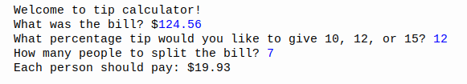

# Day2

## Lessons learned today

- Data types
```
"strings" numbers boolean
```
- Type conversions
```
int("4") str(5) float(4)
```

- Operations

- f-strings
```
name = 'Kingdreamerr'
print(f"hello {name} !") 
```

## Project to solidify material learned 

### Tip calculator:
> This is a program that calculate how much money your friends or family and you will have to pay after a meal if you want to split the bill which is.

#### Preview:



## How to run this on your device

- Clone this repository
```
git clone https://github.com/kingdreamerr/Day2_Tip_calculator.git
```
- cd into the repo
```
cd Day2_Tip_calculator
```

- Paste the following in the terminal 
```
python3 main.py
```